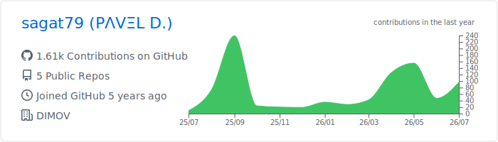
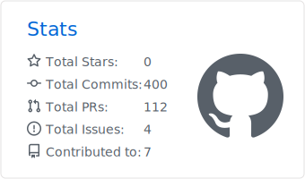
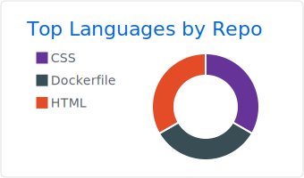

# PΛVΞL D.

*A tireless seeker of knowledge, occasional purveyor of wisdom and, coincidentally, a web designer.*

I love building applications & discussing new product ideas.

---

### 📊 GitHub Stats

  <picture>
    <source media="(prefers-color-scheme: dark)" srcset="./profile-summary-card-output/github_dark/0-profile-details.svg">
    
  </picture>
  <picture>
    <source media="(prefers-color-scheme: dark)" srcset="./profile-summary-card-output/github_dark/3-stats.svg">
    
  </picture>
  <picture>
    <source media="(prefers-color-scheme: dark)" srcset="./profile-summary-card-output/github_dark/1-repos-per-language.svg">
    
  </picture>

### ⚡ Recent Activity

<!--START_SECTION:activity-->
<!--END_SECTION:activity-->

### 📑 Latest Posts

<!-- DIMOV-POST-LIST:START -->
- [Enhancing Network Privacy: Configuring Encrypted Cloudflare DNS on UniFi](https://www.dimov.xyz/enhancing-network-privacy-configuring-encrypted-cloudflare-dns-on-unifi/)
- [How to Safely Upgrade Your WordPress Site to PHP 8.3 in 2026](https://www.dimov.xyz/how-to-upgrade-wordpress-php-8-3/)
- [Elevating Your Ghost Admin Security with Cloudflare Access](https://www.dimov.xyz/elevating-your-ghost-admin-security-with-cloudflare-access/)
<!-- DIMOV-POST-LIST:END -->

---

  ⚙️ Auto-updated by GitHub Actions · Public activity only

