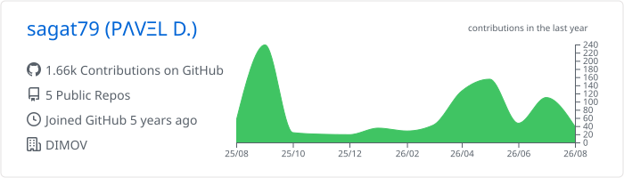
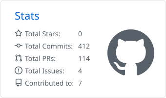
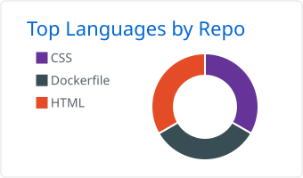

# PΛVΞL D.

*A tireless seeker of knowledge, occasional purveyor of wisdom and, coincidentally, a web designer.*

I love building applications & discussing new product ideas.

---

### 📊 GitHub Stats

  <picture>
    <source media="(prefers-color-scheme: dark)" srcset="./profile-summary-card-output/github_dark/0-profile-details.svg">
    
  </picture>
  <picture>
    <source media="(prefers-color-scheme: dark)" srcset="./profile-summary-card-output/github_dark/3-stats.svg">
    
  </picture>
  <picture>
    <source media="(prefers-color-scheme: dark)" srcset="./profile-summary-card-output/github_dark/1-repos-per-language.svg">
    
  </picture>

### ⚡ Recent Activity

<!--START_SECTION:activity-->
1. 🎉 Merged PR [#132](https://github.com/derfeldev/ansible-role-ghost/pull/132) in [derfeldev/ansible-role-ghost](https://github.com/derfeldev/ansible-role-ghost)
2. 💪 Opened PR [#132](https://github.com/derfeldev/ansible-role-ghost/pull/132) in [derfeldev/ansible-role-ghost](https://github.com/derfeldev/ansible-role-ghost)
<!--END_SECTION:activity-->

### 📑 Latest Posts

<!-- DIMOV-POST-LIST:START -->
- [Run Your Ghost Blog by Asking Claude: A Look at ghost-mcp](https://www.dimov.xyz/ghost-mcp/)
- [Hardening Claude Code: A Security-First Setup for macOS](https://www.dimov.xyz/harden-claude-code/)
- [The Ghost Full-Stack Expert Prompt: Turn Any AI Assistant Into a Ghost Developer](https://www.dimov.xyz/ghost-full-stack-expert-system-prompt/)
<!-- DIMOV-POST-LIST:END -->

---

  ⚙️ Auto-updated by GitHub Actions · Public activity only

